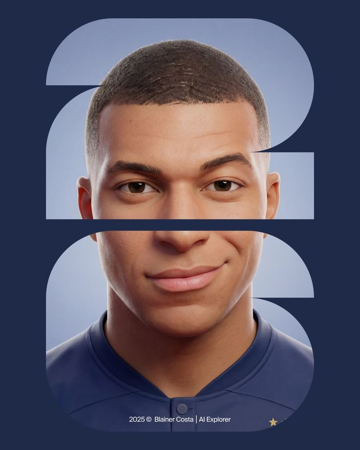

# 👨‍💻 Азамат Ибрагимов · Fullstack-разработчик & Веб-дизайнер

  

  <strong>Создаю высококачественные цифровые решения от идеи до production</strong>

---

## 🎯 О себе

Опытный **fullstack-разработчик** и **UI/UX дизайнер** с глубокими знаниями в разработке сложных систем. Специализируюсь на создании высоконагруженных приложений, микросервисной архитектуры и интеграции сложных API.

**Мой опыт включает:**
- ✅ Разработку крупномасштабных веб-приложений для компаний с миллионами пользователей
- ✅ Работу с высоконагруженными системами (RPS: 100K+)
- ✅ Оптимизацию production-кода (снижение времени отклика на 40-60%)
- ✅ Управление базами данных с объёмом > 1 ТБ
- ✅ Внедрение CI/CD pipelines и автоматизацию тестирования
- ✅ Лидирование в agile-командах из 5-15 разработчиков
- ✅ Полный цикл разработки: анализ, проектирование, разработка, тестирование, поддержка

**Результаты:**
- Увеличение производительности приложений на **35-50%**
- Снижение ошибок в production на **70%**
- Сокращение времени разработки нового функционала на **25-30%**

---

## 💻 Профессиональные навыки

### Frontend разработка

### Backend разработка

### Базы данных и кеширование

### DevOps и инструменты

### Специализированные технологии

---

## 🎨 Спектр услуг

### Веб-приложения & Сайты
- **E-commerce платформы** с интеграцией платежных систем
- **SaaS приложения** для управления данными
- **CMS и порталы** с расширенным функционалом
- **Real-time приложения** (чаты, коллаборация, live-обновления)
- **Прогрессивные веб-приложения (PWA)**

### Серверная логика & Архитектура
- Микросервисная архитектура
- RESTful & GraphQL API
- Аутентификация и авторизация (OAuth, JWT)
- High-load optimization
- Интеграция третьих сервисов

### Чат-боты & Автоматизация
- **Telegram боты** (команды, inline-кнопки, файлы)
- **WhatsApp боты** для бизнеса
- **Discord/Slack боты**
- **Автоматизация рабочих процессов**
- Обработка естественного языка (NLP)

### Дизайн & Интерфейсы
- **UI/UX дизайн** адаптивных интерфейсов
- **Дизайн-системы** и компонентные библиотеки
- **Анимация и микровзаимодействия**
- **Оптимизация конверсии**

### Игровые проекты
- **SA-MP серверы** и моды
- **Web games** на JavaScript/WebGL
- **Game backends** с реальным временем
- **Мультиплеер системы**

---

## 🏆 Некоторые публичные работы

<table>
<tr>
<td align="center">
<a href="https://t.me/ibragimov_dev/9">
<strong>Проект 1</strong> 
Веб-приложение 

</a>
</td>
<td align="center">
<a href="https://t.me/ibragimov_dev/11">
<strong>Проект 2</strong> 
API Сервис 

</a>
</td>
<td align="center">
<a href="https://t.me/ibragimov_dev/17">
<strong>Проект 3</strong> 
Чат-бот 

</a>
</td>
</tr>
<tr>
<td align="center">
<a href="https://t.me/ibragimov_dev/18">
<strong>Проект 4</strong> 
E-commerce 

</a>
</td>
<td align="center">
<a href="https://t.me/ibragimov_dev/24">
<strong>Проект 5</strong> 
СMS Система 

</a>
</td>
<td align="center">
<a href="https://t.me/ibragimov_dev/25">
<strong>Проект 6</strong> 
Real-time App 

</a>
</td>
</tr>
<tr>
<td align="center">
<a href="https://t.me/ibragimov_dev/29">
<strong>Проект 7</strong> 
UI/UX Дизайн 

</a>
</td>
<td align="center">
<a href="https://t.me/ibragimov_dev/37">
<strong>Проект 8</strong> 
Игровой сервер 

</a>
</td>
<td align="center">
<a href="https://t.me/ibragimov_dev/39">
<strong>Проект 9</strong> 
API Интеграция 

</a>
</td>
</tr>
<tr>
<td colspan="3" align="center">
<a href="https://t.me/ibragimov_dev/40">
<strong>➕ Проект 10 и более</strong> в моём Telegram канале
</a>
</td>
</tr>
</table>

---

## 💼 Сотрудничество

Открыт к взаимовыгодному сотрудничеству в рамках следующих направлений:

### ✅ Беру в работу

- ✔️ Разработка **сайтов и веб-приложений** (с нуля и доработки)
- ✔️ **Серверная логика** и архитектура приложений
- ✔️ **Интеграция API** и внешних сервисов
- ✔️ **Чат-боты** для Telegram, WhatsApp, Discord
- ✔️ **Автоматизация** и скрипты
- ✔️ **Игровые проекты** (SA-MP, Web games)
- ✔️ **Веб-дизайн** и интерфейсы
- ✔️ **Рефакторинг и оптимизация** существующего кода
- ✔️ **Консультации** по архитектуре и best practices

### 📅 Формы сотрудничества

- **Проектная работа** (фиксированная стоимость)
- **Почасовая ставка** (для консультаций)
- **Долгосрочное сотрудничество** (штатно или удаленно)
- **Аутстаффинг команды** разработчиков

### ❌ Не рассматриваю

- 🚫 Казино и букмекерские конторы
- 🚫 Пирамиды и мошеннические схемы
- 🚫 Проекты без юридической базы
- 🚫 Работа за минимальную оплату без уважения к профессии

---

## 📞 Контакты и ссылки

  <strong>Время ответа:</strong> Обычно в течение 2-4 часов 📨

---

**Мой подход:**
- 🔍 Глубокое понимание требований до начала кодирования
- 🏗️ Архитектура, ориентированная на масштабируемость
- 🧪 Покрытие кода тестами (unit, integration, e2e)
- 📚 Документирование кода и API
- 🔄 Постоянное улучшение и refactoring
- 👥 Прозрачность и регулярное общение с клиентом

---

  <strong>💪 Готов принять вызов и создать что-то великое вместе с вами!</strong>

